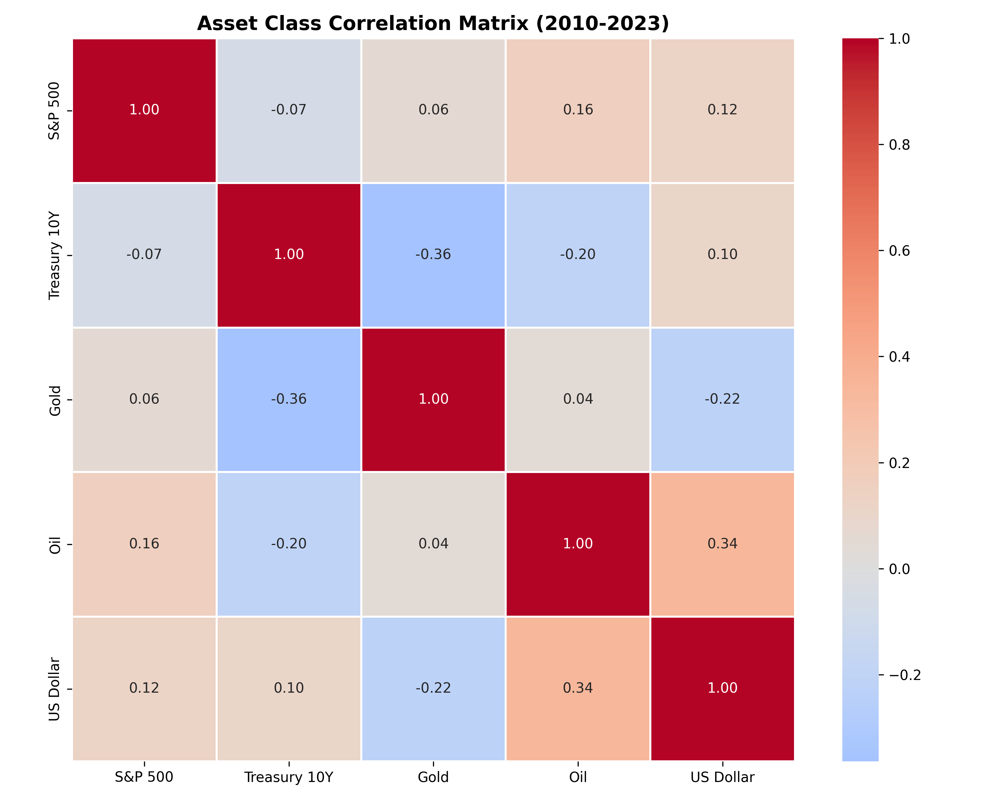
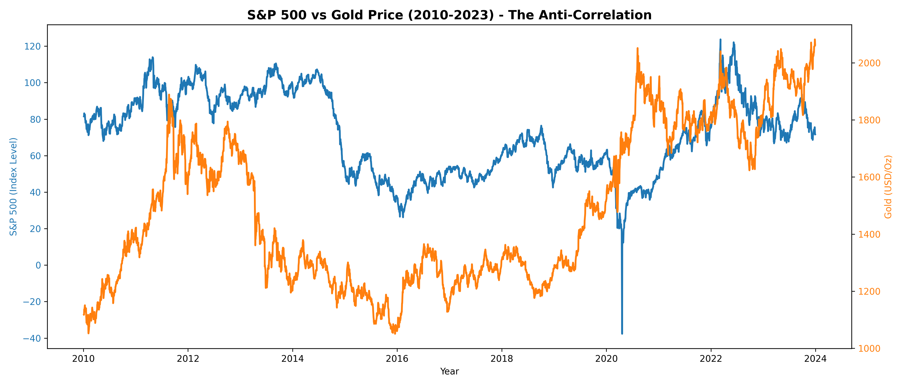

# 📊 Macro-Market Correlation

I wanted to understand how different assets actually move together in the real world, not just in textbooks. So I pulled 10 years of daily data for stocks (S&P 500), bonds (10Y Treasury), gold, oil, and the dollar.

## What I Found

| Relationship | Correlation | My Take |
|--------------|-------------|---------|
| S&P 500 & Gold | +0.06 | Basically zero. They don't move together at all - that's actually good for diversification. |
| Gold & Bonds | -0.36 | When bond yields rise, gold falls. Makes sense - bonds start paying actual interest again. |
| Dollar & Oil | +0.34 | This surprised me. Usually a strong dollar = cheaper oil. But over 10 years, they actually moved together. |
| Dollar & Gold | -0.22 | Classic inverse relationship. When the dollar weakens, gold gets more expensive. |

## 📈 Visuals

### Correlation Heatmap

*The darker the red/blue, the stronger the relationship.*

### S&P 500 vs Gold

*You can see them pulling in opposite directions during big market events.*

## 📁 Files

- `macro_market_dashboard.ipynb` - the code
- `asset_correlation_heatmap.png` - correlation matrix
- `sp500_vs_gold.png` - comparison chart

## About This Project

I built this because I wanted to practice three things:
1. Pulling financial data from Yahoo Finance
2. Basic correlation analysis
3. Making clean visualizations that actually tell a story

Honestly, the Dollar-Oil correlation was the most surprising part. I'd be curious to see if it holds up over different time periods.

## How I Did It

Just Python + yfinance + pandas + matplotlib/seaborn. 
